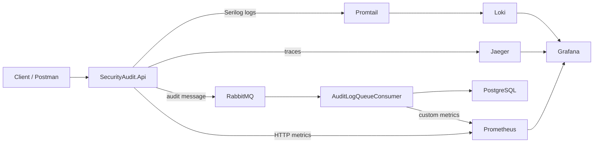
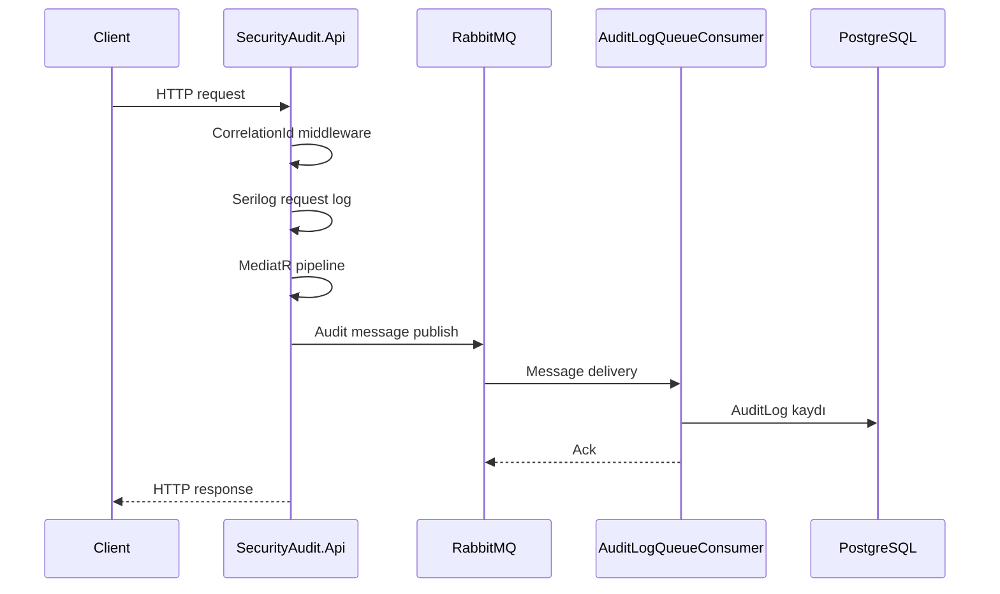

# SecurityPlatform Observability Lab

Bu repository artık bir microservice deneyi değil. Amaç, tek bir .NET uygulaması üzerinden
observability araçlarını birlikte göstermek ve öğrenmek:

- **Loglama**: Serilog
- **Tracing**: OpenTelemetry + Jaeger
- **Health checks**: `/health/live` ve `/health/ready`
- **Metrics**: `/metrics` endpointi + Prometheus + Grafana
- **Messaging**: RabbitMQ ile audit olaylarını kuyruk üzerinden işlemek
- **Correlation**: İstek, log ve trace akışını aynı kimlikle bağlamak

## Mimari



## İstek Akışı



## Bu projede ne var?

### 1) Logging
Serilog, uygulama loglarını JSON formatında üretir. Loglar Docker container stdout’una gider,
Promtail bunları toplar ve Loki’ye yollar. Grafana üzerinden sorgulanabilir.

### 2) Tracing
OpenTelemetry tracing aktif. HTTP isteği ve MediatR adımları boyunca span üretilir,
trace’ler Jaeger’e gönderilir.

### 3) Health
Uygulamada iki temel sağlık endpoint’i vardır:

- `GET /health/live`
- `GET /health/ready`

### 4) Metrics
`GET /metrics` endpointi Prometheus formatında metrik üretir.
Prometheus bu endpointi scrape eder, Grafana da buradan dashboard çeker.

Metrikler:

- başarılı audit publish sayısı
- publish hata sayısı
- başarılı consume sayısı
- consume hata sayısı
- ortalama consume süresi

### 5) Messaging
Audit olayları RabbitMQ kuyruğuna yazılır, consumer bunları okuyup PostgreSQL’e kaydeder.
Bu kısım asynchronous akış ve queue mantığını göstermek için bırakıldı.

## Çalıştırma

Önce Docker stack’i kaldır:

```bash
docker compose up -d
```

Ardından uygulama endpointleri:

- API: `http://localhost:5336`
- Health: `http://localhost:5336/health/live`
- Ready: `http://localhost:5336/health/ready`
- Metrics: `http://localhost:5336/metrics`
- Prometheus: `http://localhost:9090`
- Grafana: `http://localhost:3000`
- Jaeger: `http://localhost:16686`
- RabbitMQ: `http://localhost:15672`

Grafana giriş bilgileri:

- kullanıcı adı: `admin`
- şifre: `admin`

## Klasör Yapısı

- `src/BuildingBlocks/SecurityPlatform.BuildingBlocks`
  - logging
  - tracing
  - health
  - correlation
  - audit client
  - metrics store
- `src/SecurityAudit/SecurityAudit.Api`
  - audit endpointleri
  - RabbitMQ consumer
  - PostgreSQL persistence

## Öğrenme Hedefi

Bu proje şu soruların cevabını gösterir:

- Bir istek nasıl loglanır?
- Correlation ID nasıl taşınır?
- Trace nasıl oluşur?
- Health check ne işe yarar?
- Metrikler nasıl üretilir ve scrape edilir?
- RabbitMQ mesajı nasıl akıtır?
- Bir olay nasıl kayda dönüşür?

## Not

Bu repository artık bir production mikroservis platformu değil; observability araçlarını öğretmek için
oluşturulmuş tek uygulamalı bir laboratuvar ortamı.
